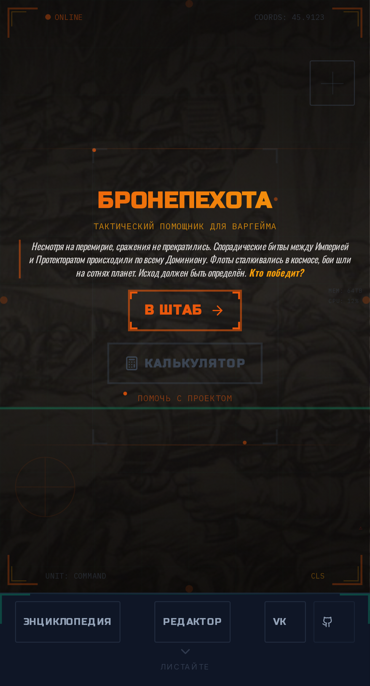
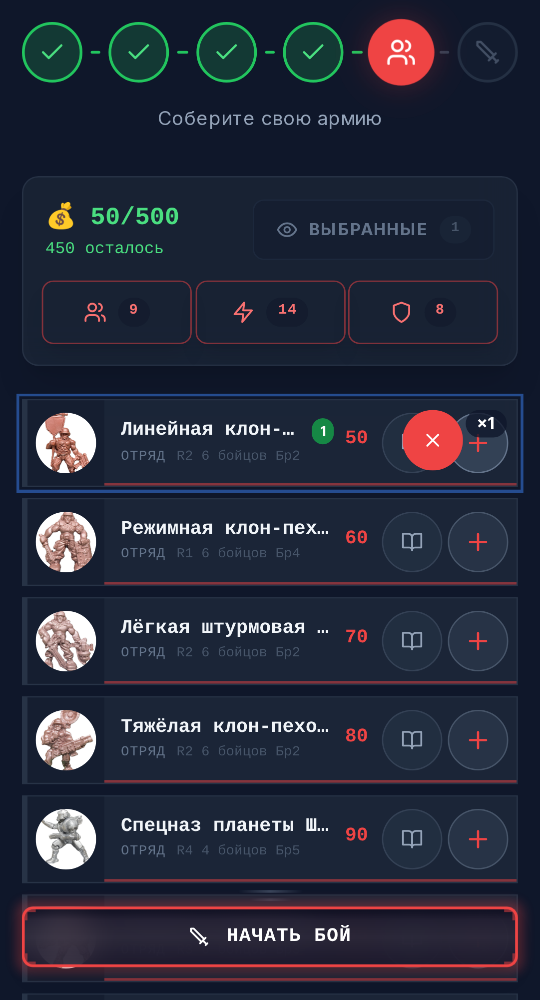
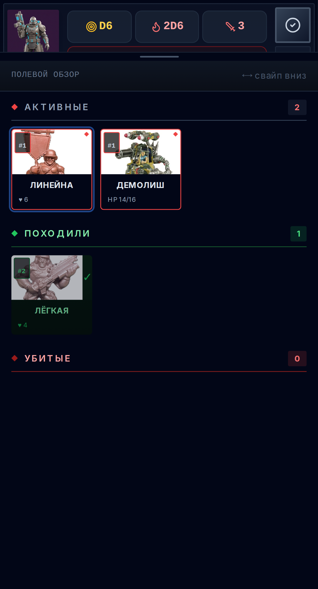
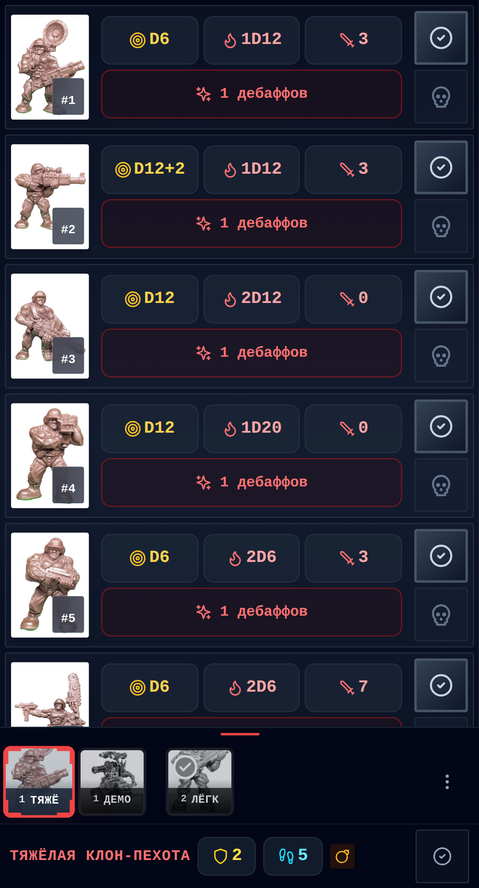
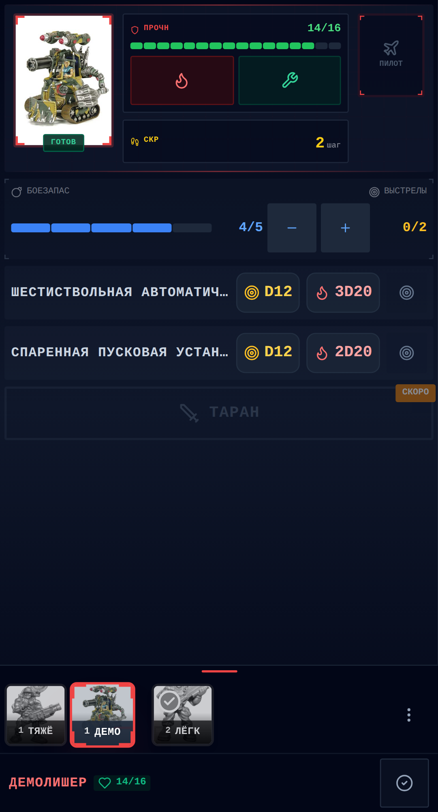
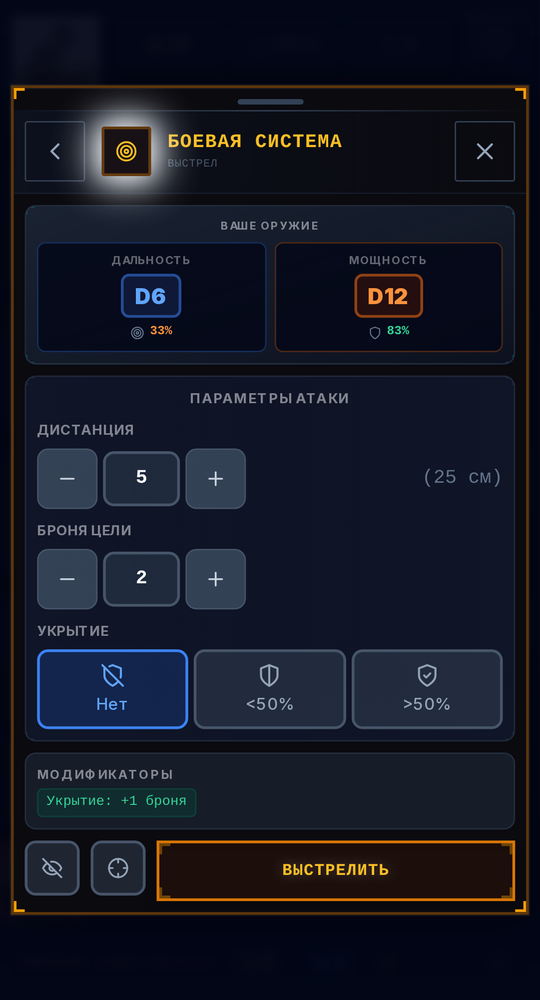
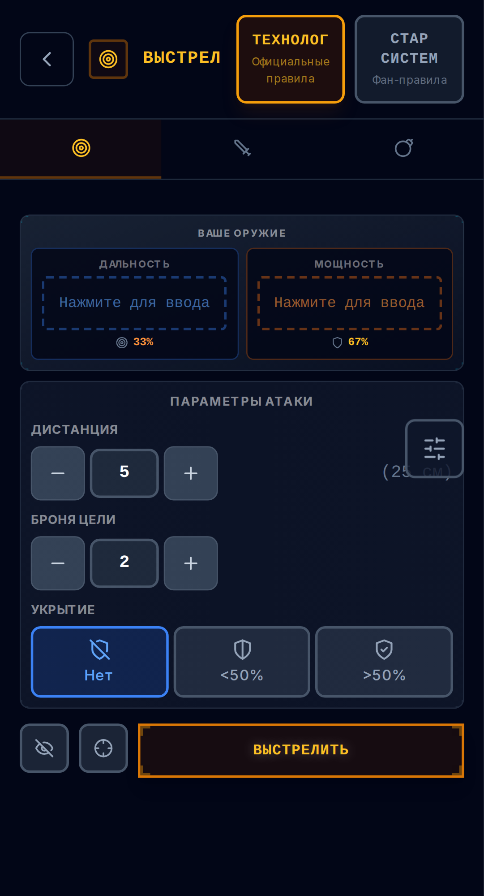
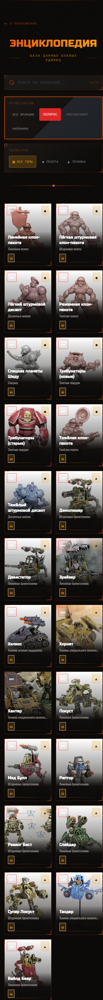

# Бронепехота

Веб-приложение для настольного варгейма «Бронепехота» от компании [Технолог](http://www.tehnolog.ru/).

  

Приложение можно использовать в двух режимах — на усмотрение игрока. В минимальном варианте это цифровая база карточек и конструктор армии: вы собираете отряды и видите параметры на экране телефона, а кости бросаете руками как обычно. В полном варианте приложение берёт на себя и расчёт бросков — учитывает вероятности, модификаторы и результаты попаданий.

**Попробуйте** поиграть [на сайте проекта](https://luxor.github.io/bronepehota/)

## Фракции

**31 отряд пехоты** и **28 боевых машин** — всего **59 уникальных юнитов**.

### Поларис (Polaris)

Космическая империя с жёсткой централизацией и милитаризированным обществом. Поларис делает ставку на клон-пехоту — массово производимых солдат-клонов, преданных императору.

* **9 отрядов пехоты** — от линейной клон-пехоты до элитных гвардейцев
* **14 боевых машин** — разнообразная техника от лёгких разведывательных до тяжёлых штурмовых
* **Стиль игры**: массовость, стандартизация, мощная огневая поддержка

### Протекторат (Protectorate)

Федерация планет, объединённая идеалами защиты и сотрудничества. Протекторат опирается на профессиональных солдат и планетарное ополчение.

* **14 отрядов пехоты** — от планетарного ополчения до элитных подразделений
* **14 боевых машин** — сбалансированный парк техники
* **Стиль игры**: гибкость, профессионализм, адаптивность

### Наёмники (Mercenaries)

Разнообразные военные корпорации, freelance-командиры и искатели приключений. Наёмники предлагают свои услуги тому, кто платит.

* **8 отрядов пехоты** — местные ополченцы, наёмные пехотинцы, аборигены
* **0 боевых машин** — фракция фокусируется на пехоте
* **Стиль игры**: низкая стоимость, специализация, asymmetric warfare

## Возможности приложения

### Сбор армии

  

* **Выбор фракции** — три фракции: Поларис, Протекторат, Наёмники
* **Добавление юнитов** — отряды пехоты и боевые машины с фильтрацией и поиском
* **Лимит очков** — настройка бюджетного ограничения армии
* **Автонумерация** — автоматическая нумерация отрядов при добавлении
* **Сохранение** — армия автоматически сохраняется в браузере

### Навигатор по карточкам в бою

  

* **Карточки отрядов и машин** — все юниты доступны на экране телефона
* **Отслеживание состояния** — прочность, боеприпасы, потери, действия
* **Навигация между юнитами** — одним касанием

### Карточки отрядов и машин

  

* **Параметры каждого солдата** — ранг, скорость, дальность, мощь, рукопашная, броня
* **Кнопка «Выберите действие»** — открывает боевой калькулятор от выбранного бойца

  

* **Карточка машины** — вооружение, боеприпасы, уровень прочности

### Боевой калькулятор

  

* **Автоподстановка параметров** — дальность и мощность оружия подставляются автоматически
* **Модификаторы** — баффы, дебаффы и способности отслеживаются и учитываются при расчёте
* **Три типа действий** — выстрел, ближний бой, метание гранаты
* **Тест паники** — проверка на панику при потере солдат (опционально)
* **Прицельная стрельба** — удвоение дальности для пехоты без движения (опционально)
* **Внезапная атака** — удар в тыл с двойным уроном (опционально)

### Отдельный калькулятор

  

* **Автономный расчёт** — не требует создания армии или начала игровой сессии
* **Ввод параметров** — дальность (D6/D12/D20), мощность, ближний бой, ранг
* **Модификаторы** — баффы, дебаффы и ручная корректировка значений
* **История ввода** — запоминает часто используемые значения кубиков
* **Два набора правил** — Технолог и Star System

### Энциклопедия

  

* **Полная база знаний** — информация обо всех юнитах всех фракций
* **Детальные описания** — лор (lore), класс, история создания, тактика применения
* **Изображения** — визуальная справка по всем моделям солдат и машин
* **Фильтрация и поиск** — быстрый поиск нужного юнита по фракции, типу, названию

### Редактор отрядов

* **Создание собственных армий** — новые фракции, отряды и машины с любыми параметрами
* **Сохранение данных** — в файл или на Google Drive
* **Перенос между устройствами** — с компьютера на телефон

### Дополнительно

* **PWA** — работает через браузер без установки из магазина, занимает максимум экрана
* **Анимация кубиков** — визуализация бросков с результатами (D6, D12, D20)
* **Mobile First** — оптимизировано для мобильных устройств с поддержкой swipe-жестов
* **Оффлайн** — базовые функции доступны без интернета

## Быстрый старт

1. Откройте https://luxor.github.io/bronepehota/
2. Выберите набор правил и источник армлиста
3. Выберите фракцию и укажите лимит очков
4. Добавьте отряды и технику, затем нажмите «В бой»
5. Управляйте юнитами во вкладке «Войска», рассчитывайте бой во вкладке «Атака»

Или попробуйте **[калькулятор боя](https://luxor.github.io/bronepehota/calculator)** — рассчитайте выстрел, ближний бой или бросок гранаты без создания армии.

## Благодарности сообществу Star System

Этот проект был бы невозможен без поддержки и вклада сообщества **[Star System (https://vk.com/bp_bnp)](https://vk.com/bp_bnp)**.

### Особая благодарность

Выражаем искреннюю благодарность активным участникам сообщества, которые годами развивают вселенную игры:

* **За оригинальные армлисты и техлисты** — новый фундамент игровой механики. Методическая база, создававшаяся годами, позволяет новичкам и ветеранам наслаждаться игрой
* **За разработку новых правил** — расширение механик, добавление глубины и тактического разнообразия
* **За модернизацию армлистов** — постоянную работу по балансу и обновлению данных, поддерживая игру актуальной и интересной
* **За сохранение истории** — архивирование материалов, создание баз знаний, помощь новичкам

### Присоединяйтесь

Если вы хотите узнать больше об игре, найти партнёров для игр или внести свой вклад в развитие сообщества:

* **VK-группа**: [https://vk.com/bp_bnp](https://vk.com/bp_bnp)
* Участвуйте в обсуждениях, делитесь repaint-ами, предлагайте новые армлисты

## Документация

* **[DEVELOPMENT.md](DEVELOPMENT.md)** — документация для разработчиков
* **[CONTRIBUTING.md](CONTRIBUTING.md)** — руководство по внесению вклада (добавление юнитов, создание PR)
* **[CLAUDE.md](CLAUDE.md)** — руководство для AI-ассистента и структура проекта

## Поддерживаемые правила

* **Правила от Сообщества Star System** — альтернативные правила с расширенными механиками (зонные повреждения техники, спецэффекты оружия)
* **Официальные правила (Технолог)** — базовые правила от компании Технолог

## Технологии

* **Next.js 14** — React-фреймворк с App Router
* **TypeScript 5** — типизация для надёжности кода
* **Tailwind CSS** — утилитарные CSS-классы
* **React 18** — библиотека UI
* **Playwright** — E2E тесты
* **Jest** — Unit тесты (1036+ тестов)
* **Serwist** — PWA поддержка для оффлайн-работы

## Лицензия

Проект создан с уважением к игре «Бронепехота» и не связан с компанией Технолог.

Создано с использованием **Vibe Coding** — подхода, при котором AI-ассистент (Claude Code) пишет код под руководством человека. Цели проекта:
* Полезное приложение для сообщества варгейма «Бронепехота»
* Приобщение молодого поколения к отечественным настольным варгеймам через упрощение игрового процесса
* Практика работы с AI-инструментами разработки
