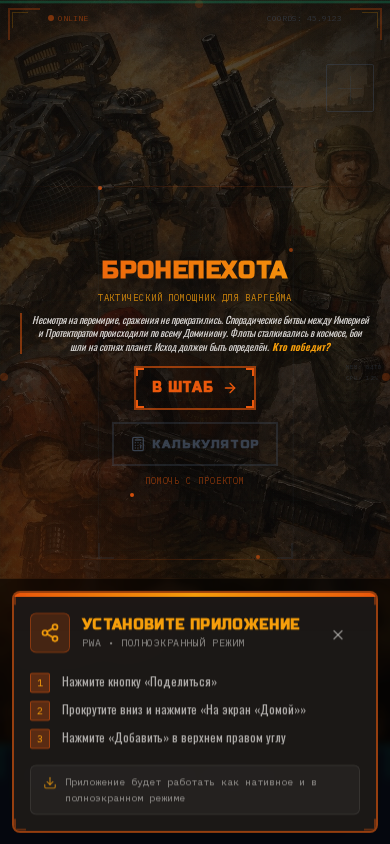
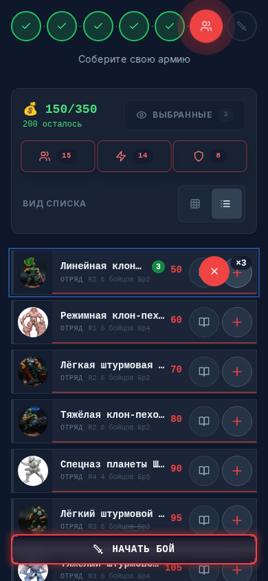
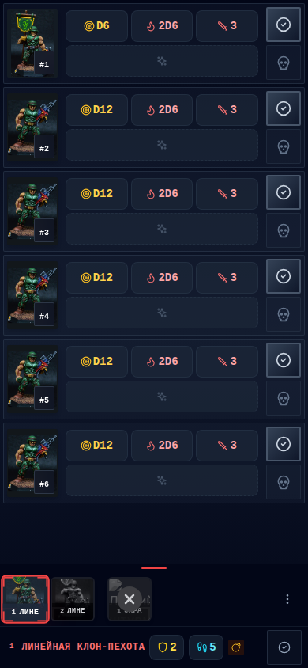
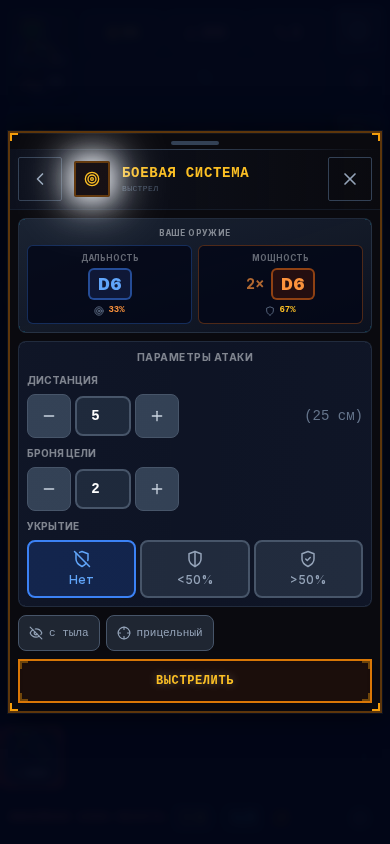
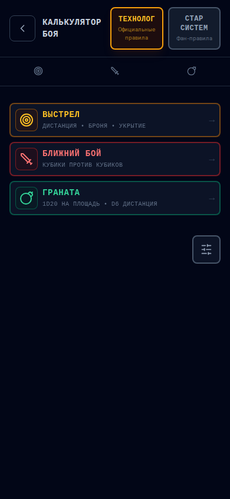
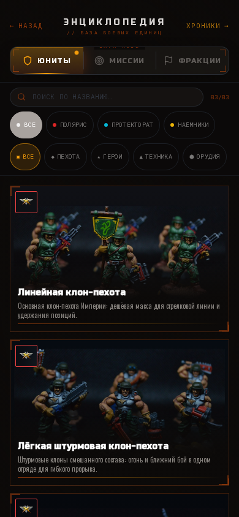

# Бронепехота

Веб-приложение для настольного варгейма «Бронепехота» от компании [Технолог](http://www.tehnolog.ru/).

  

Используется в двух режимах — на усмотрение игрока. Минимально это цифровая база карточек и конструктор армии: вы собираете отряды и видите параметры на экране телефона, а кости бросаете руками. В полном варианте приложение считает броски само — учитывает вероятности, модификаторы и результаты попаданий.

**Попробуйте** на [сайте проекта](https://luxor.github.io/bronepehota/) · отдельно — [калькулятор боя](https://luxor.github.io/bronepehota/calculator).

## Фракции

Три фракции в источнике Star System — всего **74 юнита: 44 отряда пехоты и 30 боевых машин**.

- **Поларис** — космическая империя, ставка на клон-пехоту: массовость, стандартизация, мощная огневая поддержка. **29 юнитов** (15 отрядов, 14 машин).
- **Протекторат** — федерация планет, профессиональные солдаты и ополчение: гибкость, адаптивность. **36 юнитов** (21 отряд, 15 машин).
- **Наёмники** — военные корпорации и искатели приключений: низкая стоимость, специализация. **9 юнитов** (8 отрядов, 1 машина).

> Лор и тактика фракций — также в разделе «Энциклопедия» внутри приложения.

## Возможности

  
  

- **Сбор армии** — выбор фракции, лимит очков, поиск и фильтрация, автонумерация, автосохранение в браузере.
- **Навигатор в бою** — все юниты на экране телефона, состояние прочности/боеприпасов/потерь, переход между карточками одним касанием.
- **Карточки отрядов и машин** — параметры каждого солдата (ранг, скорость, дальность, мощь, рукопашная, броня), вооружение и секторы скорости техники.
- **Боевой калькулятор** — автоподстановка параметров оружия, учёт баффов/дебаффов/способностей; три действия — выстрел, ближний бой, граната; опциональные тест паники, прицельная и внезапная стрельба.

  
  

- **Отдельный калькулятор** — расчёт боя без создания армии: ввод кубиков (D6/D12/D20), история значений, два набора правил.
- **Энциклопедия** — лор, класс, история и тактика по всем юнитам, с изображениями и поиском.
- **Редактор отрядов** *(десктоп)* — собственные фракции, отряды и машины; сохранение в файл или на Google Drive.
- **PWA / оффлайн** — установка на телефон без магазина, базовые функции без интернета; анимация бросков кубиков.

  

## Источники и правила

**Источники армлистов** (выбираются при создании армии):

- **Star System** *(сообщество)* — расширенные листы от [Star System](https://vk.com/bp_bnp): 44 отряда + 30 машин. По умолчанию.
- **Технолог Классик** *(официальный)* — оригинальные листы от [Технолог](http://www.tehnolog.ru/): 30 отрядов + 30 машин.

Любой источник сочетается с любым набором правил. Есть встроенный редактор для собственных листов.

**Наборы правил:**

- **Технолог** — базовые официальные правила.
- **Star System** *(сообщество)* — расширенные механики: зонные повреждения техники, спецэффекты оружия, тест паники, бонус за высоту.

## Быстрый старт

1. Откройте https://luxor.github.io/bronepehota/
2. Выберите набор правил и источник армлиста
3. Выберите фракцию и укажите лимит очков
4. Добавьте отряды и технику, нажмите «В бой»
5. Управляйте юнитами во вкладке «Войска», рассчитывайте бой во вкладке «Атака»

Или сразу в **[калькулятор боя](https://luxor.github.io/bronepehota/calculator)** — рассчитать выстрел, ближний бой или гранату без создания армии.

## Сообщество

Проект существует благодаря сообществу **[Star System — Бронепехота B&P](https://vk.com/bp_bnp)**: армлисты, правила, покрашенные миниатюры. Благодарности и контакты — в **[docs/COMMUNITY.md](docs/COMMUNITY.md)**.

## Документация

- **[DEVELOPMENT.md](DEVELOPMENT.md)** — для разработчиков (установка, команды, архитектура)
- **[CONTRIBUTING.md](CONTRIBUTING.md)** — как внести вклад (баг-репорты, новые юниты, PR)
- **[docs/COMMUNITY.md](docs/COMMUNITY.md)** — сообщество и благодарности
- **[CLAUDE.md](CLAUDE.md)** — структура проекта для AI-ассистента

## Лицензия

Проект создан с уважением к игре «Бронепехота» и не связан с компанией Технолог. Сделано через **Vibe Coding** — AI-ассистент пишет код под руководством человека.
